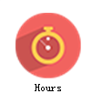

# Hours(勤补拙)

####This is a to-do demo using jQuery Mobile framework. :)

Have you ever heard about 10000 Hours Law?It was fisrt proposed by MalcolmGladwell in his book 《Outliers: The Story of Success》.

If you want to improve your skill to a master level, you are supposed to spend no less than 10000 hours studying or working on it.Therefore I hava made up my mind to make a webapp to supervise the progress of plans.

 ---

####There are some skills I have practised in this demo.
- indexedDB
- setInterval
- jQuery theme
- jQuery Mobile
- Cordova

* * * 
####APP_screenshot

▲APP_icon▲

▲home▲

▲add▲

▲about▲

▲setting▲

▲record▲

▲detail▲

▲delete▲

* * *

